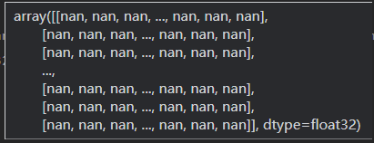
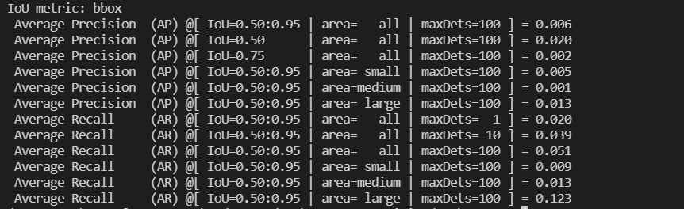
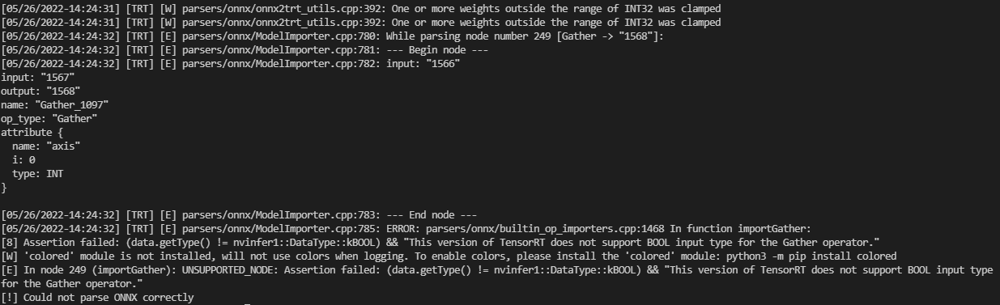
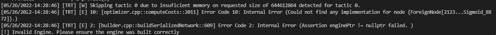

# trt-hackathon-2022

## 原始模型
### 模型简介
Anchor DETR [[pdf]](https://arxiv.org/abs/2109.07107)[[code]](https://github.com/megvii-research/AnchorDETR)
- 用途以及效果
- AnchorDETR是旷视提出的一种基于Transformer的目标检测器，其引入了基于锚点的查询设计，并设计了行-列分离注意力的注意力变体，使得AnchorDETR可以减少内存使用的同时，提升了精度和减少了训练代数。
- 模型的整体结构如下

### 模型优化的难点
- 问题1：pytorch转onnx出现nan

- 问题2：pytorch转onnx推理精度出现问题

- 问题3：onnx转trt时节点类型不支持

- 问题4：onnx转trt时生成模型显存不足

- 问题5：行-列分离注意力的高效实现

