# AnchorDETR 在TensorRT的部署优化

## 总述
本项目是[trt-hackathon-2022](https://tianchi.aliyun.com/competition/entrance/531953/information) 决赛项目(荣获三等奖), 我们将AnchorDETR从Pytorch模型转换到TensorRT并部署到NVIDIA A10 GPU上。
- 原始模型：Anchor DETR [[pdf]](https://arxiv.org/abs/2109.07107)[[code]](https://github.com/megvii-research/AnchorDETR)
- 优化方式：实现了MaskedSoftmax Plugin,LayerNorm Plugin, AddBiasTranspose Plugin, Mask2Pos Plugin, 开启了FP16模式。
- 优化效果：
  - 精度上, 优化模型在COCO2017验证集上的mAP=43.934%, 相比原始精度, mAP下降0.329%。
  - 性能上, 优化模型的latency=15.3353 ms, throughtput=70.4344 qps, 相比于TRT自动优化的原始模型, 提速315.808%。
  - 发现了一个bug, 并提交了[issue](https://github.com/NVIDIA/trt-samples-for-hackathon-cn/issues/33)。
  
## 使用说明

### 准备环境
拉取docker镜像
```
sudo docker pull registry.cn-hangzhou.aliyuncs.com/trt2022/trt-8.4-ga
```
启动docker镜像, 并挂在工作目录到/target下
```
sudo docker run -it --gpus all --name trt2022-final -v your_dir:/target registry.cn-hangzhou.aliyuncs.com/trt2022/trt-8.4-ga:latest
```
安装tensorrt-8.4.1.5
```
cd /workspace
pip install tensorrt-8.4.1.5-cp38-none-linux_x86_64.whl
```
前往[官网](https://developer.nvidia.com/nvidia-tensorrt-download)下载TensorRT 8.4 GA for Linux x86_64 and CUDA 11.0, 11.1, 11.2, 11.3, 11.4, 11.5, 11.6 and 11.7 TAR Package, 将它解压在/usr/local下, 设置~/.bashrc中的环境变量
```
export PATH=/usr/local/TensorRT-8.4.1.5/bin:$PATH
export LD_LIBRARY_PATH=/usr/local/TensorRT-8.4.1.5/lib:$LD_LIBRARY_PATH
export LIBRARY_PATH=/usr/local/TensorRT-8.4.1.5/lib/stubs:$LIBRARY_PATH
```
修改完后激活环境变量
```
source ~/.bashrc
```

### 克隆仓库
```
git clone https://github.com/YukSing12/trt-hackathon-2022
cd trt-hackathon-2022
pip install -r requirements.txt
```
本项目在python=3.8.10, pytorch=1.9.1, torchvision=0.10.1环境下测试

### 准备数据
详见[说明](datasets/README.md)

### 运行命令
```
cd trt-hackathon-2022/onnx2trt
bash build_anchor_detr.sh
```

## 原始模型
### 模型简介
- AnchorDETR是旷视提出的一种基于Transformer的目标检测器, 其引入了基于锚点的查询设计, 并设计了行-列分离注意力的注意力变体, 使得AnchorDETR可以减少内存使用的同时, 提升了精度和减少了训练代数。
- 模型的整体结构如下


### 模型优化的难点
- 问题1：pytorch转onnx出现nan

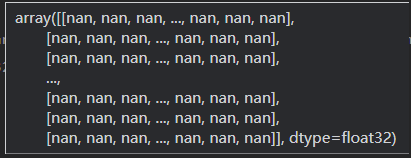

- 解决1：AnchorDETR目录下, anchor_detr的forward输入的是一个NestedTensor, 需要将其拆分为两个tensor输入[(代码)](./onnx2trt/AnchorDETR/models/anchor_detr.py#L76)

- 问题2：pytorch转onnx推理精度出现问题

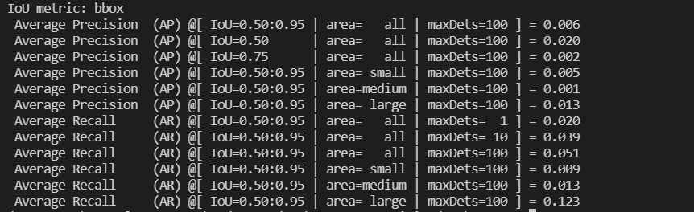

- 解决2：有一些python数据流没有被记录而作为常量, 需要根据warning, 修改一些已知的变量, 如[(代码)](./onnx2trt/AnchorDETR/models/transformer.py#L403)

- 问题3：onnx转trt时节点类型不支持

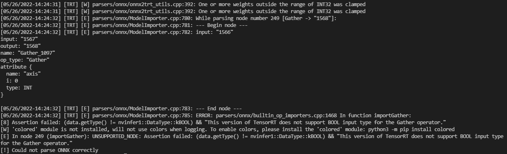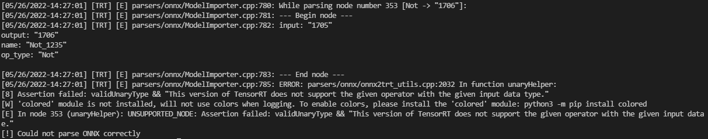

- 解决3：修改onnx图, 插入一些类型转换节点。[代码](onnx2trt/modify_AnchorDETR.py#L794-L798)

- 问题4：onnx转trt时生成模型显存不足
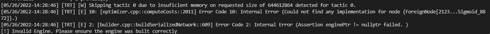
- 解决4：更新至TensorRT8.4.1.5可以直接生成模型, 同时插入plugin也可以使模型成功生成。

- 问题5: 生成的TensorRT动态宽高模型推理出现nan

- 解决5: 修改python[代码](onnx2trt/AnchorDETR/models/transformer.py#L429-L430)

- 问题6：行-列分离注意力RCDA(row column decoupled attention)的高效实现

- 解决6：尝试将里面除MatMul外的其他操作写成Plugin

## 优化过程
以下实验数据均在NVIDIA A10服务器上测试, TensorRT版本为8.4.1.5。

精度测试脚本为得为[inference_trt_dynamic_shape.sh](onnx2trt/AnchorDETR/inference_trt_dynamic_shape.sh), (由于TRT自动生成的原始模型精度有问题, 已提交bug, 因此采用pytorch模型的精度作为baseline)baseline精度为44.263%mAP。

性能测试采用trtexec, 形状与精度测试的动态形状一致, 最小形状为320x512, 最大形状为1344x1344, 最优形状为800x800。
### TRT自动优化
以TF32模式TensorRT自动优化作为基准, 测的latency=46.2253 ms, throughtput=22.3029 qps, mAP=8.686%
### 插入MaskedSoftmax Plugin
- 优化前(latency=46.2253 ms, throughtput=22.3029 qps, mAP=8.686%)：从图中可以看到, myelin合并了许多操作在一起, 导致copyPackedKernel占比很大, 占27.2%, 其中MaxSubExpResSumDiv代表Softmax操作, 而这里的Softmax是带mask的, 因此可以自定义一个MaskedSoftmax Plugin来代替这些算子。
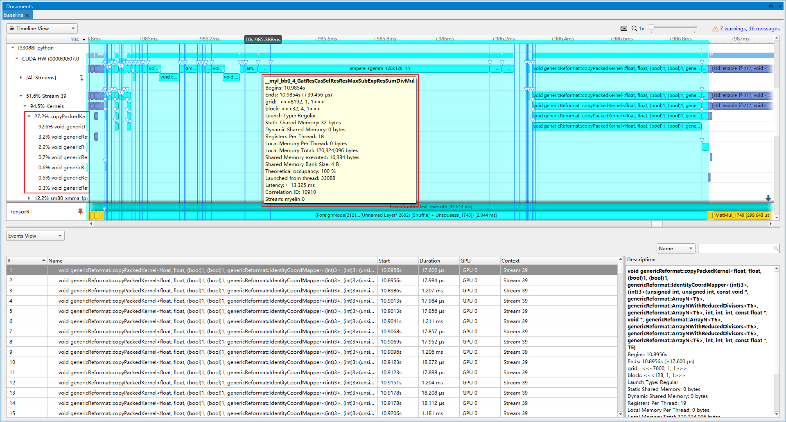
- 优化后(latency=39.5283 ms, throughtput=26.5501 qps, mAP=44.270%)：插入MaskedSoftmax Plugin后, 精度正常。copyPackedKernel占比下降到4.4%, masked_softmax算子占比2.0%, 提速19.04%。
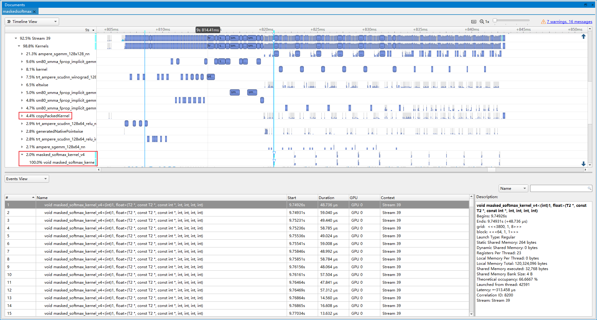
### 开启FP16模式
- 优化前(latency=39.5283 ms, throughtput=26.5501 qps, mAP=44.270%)：开启fp16是收益较大的, 只需要几行命令, 同时使算子也支持FP16就可以提速。
- 优化后(latency=18.0688 ms, throughtput=57.9584 qps, mAP=43.977%)：开启fp16后, mAP下降0.293%, 提速118.30%。
### 优化Tile 节点
- 优化前(latency=18.0688 ms, throughtput=57.9584 qps, mAP=43.977%)：从图中可以看到naiveSlice占了总推理时间3.1%, 其对应着Tile算子, 而实际上每次推理AnchorDETR这些算子都在重复计算, 它们的结果都是同一个, 叫[posemb](./onnx2trt/AnchorDETR/models/transformer.py#L126), 因此可以优化掉重复的Tile节点。同理posemb1d, posemb2d也可以被优化掉。
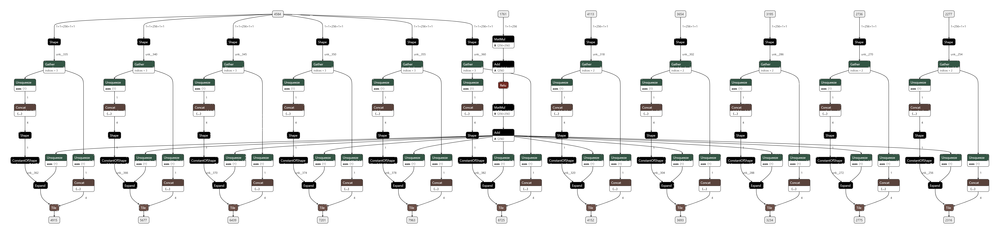
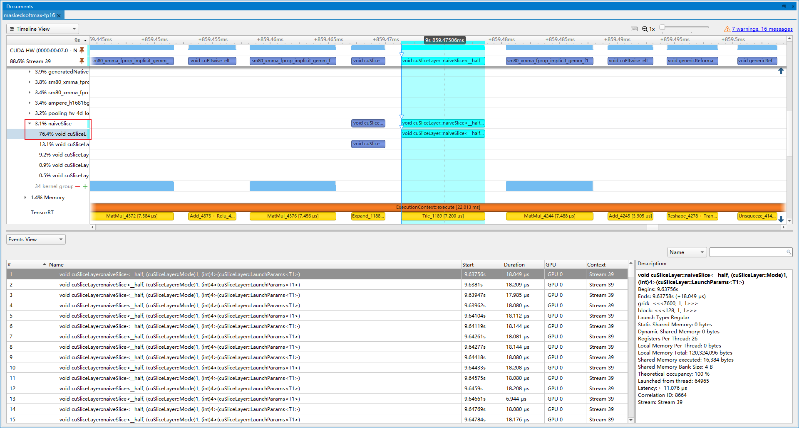
- 优化后(latency=17.3054 ms, throughtput=59.1553 qps, mAP=43.977%)：naiveSlice的占比下降到0.6%, 提速2.07%。
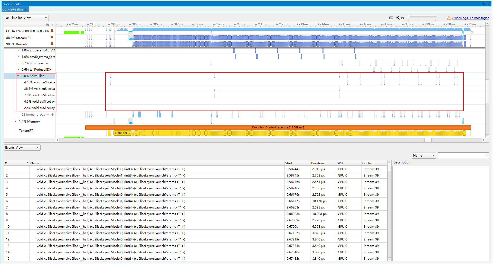

### 合并参数
- 优化前(latency=17.3054 ms, throughtput=59.1553 qps, mAP=43.977%)：Nsight system展示了许多copyPacke操作, 总共占比10.6%, 其中就有许多是合并Slice和Transpose获取权重和偏置的操作, 对应RCDA[代码](onnx2trt/AnchorDETR/models/row_column_decoupled_attention.py#L130)。通过slice操作获得的参数, 实际可以提前计算得到, 从而减少计算。
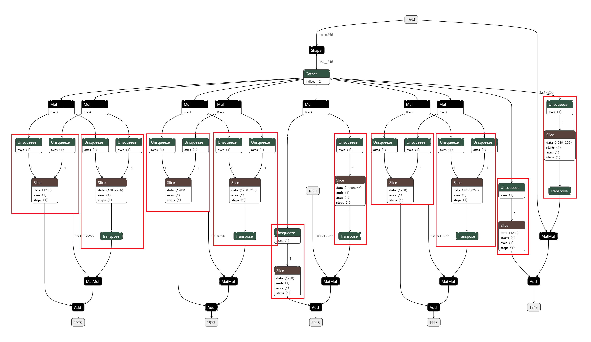
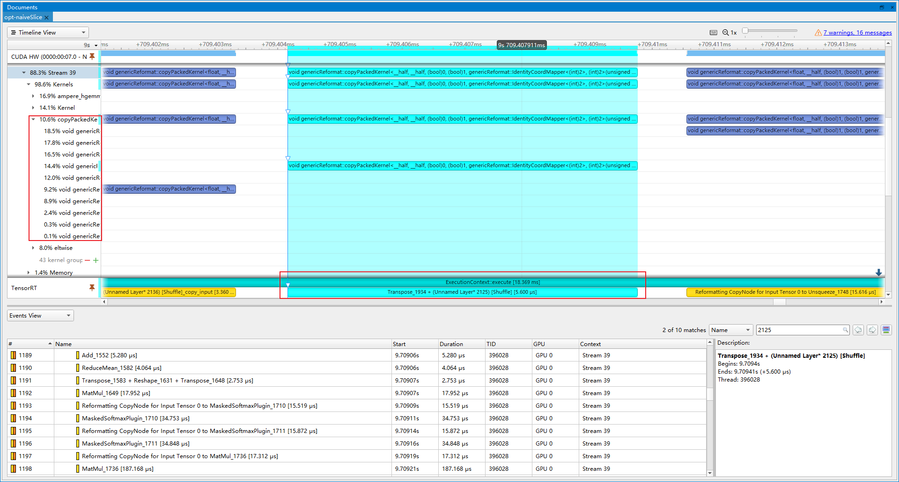
- 优化后(latency=16.7689 ms, throughtput=62.9635 qps, mAP=43.938%)：copyPacke操作占比下降到4.6%, 提速6.44%。剩余的copyPacke操作则是Transpose+Reshape的合并。
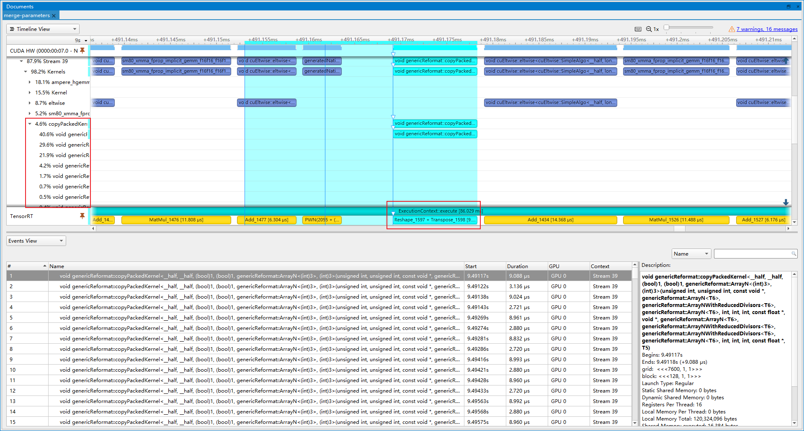

### 插入LayerNorm Plugin
- 优化前(latency=16.7689 ms, throughtput=62.9635 qps, mAP=43.938%)：LayerNorm操作实际上由多个小算子组合而成, 导致不断launch内核带来开销, 因此我们插入LayerNorm Plugin, 代替这些小算子。
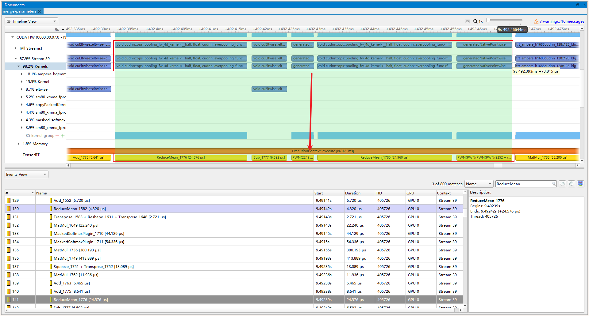
- 优化后(latency=16.5521 ms, throughtput=67.0348 qps, mAP=43.891%)：最终LayerNorm Plugin操作占比1.0%, 提速6.47%。
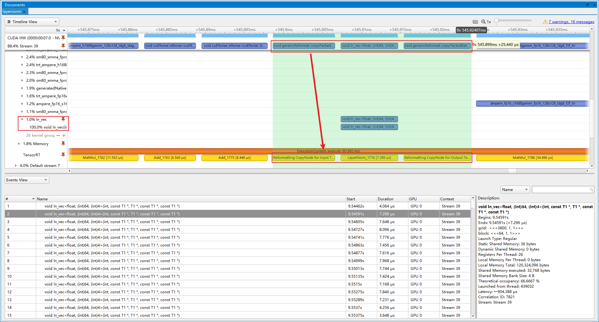

### 插入AddBiasTranspose Plugin
- 优化前(latency=16.5521 ms, throughtput=67.0348 qps, mAP=43.891%)：RCDA里面, q_row和q_col分别要进行Add Bias, Transpose, Mul, Reshape, Transpose操作。这些操作可以写成一个Plugin。
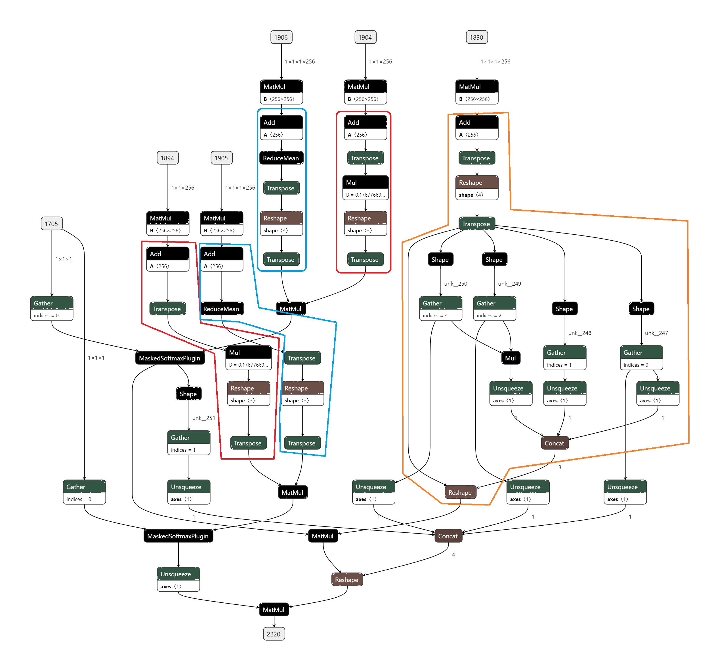
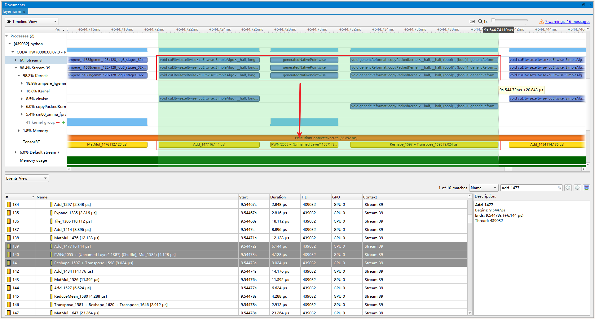
- 优化后(latency=15.7594 ms, throughtput=69.0925 qps, mAP=43.920%)：插入Plugin后, 提速3.07%。
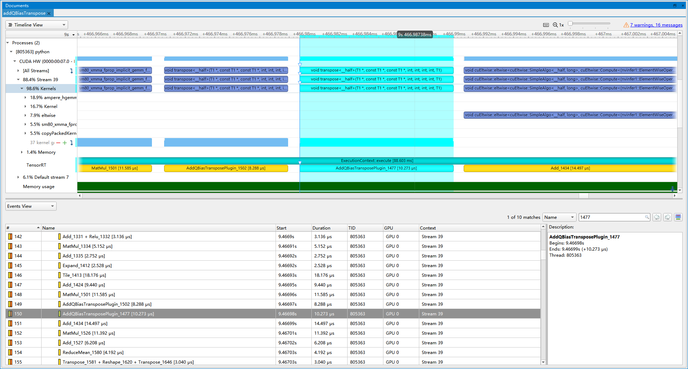

### 插入Mask2Pos Plugin
- 优化前(latency=15.7594 ms, throughtput=69.0925 qps, mAP=43.920%)：TRT将[mask2pos以及pos2posemb1d](onnx2trt/AnchorDETR/models/transformer.py#L124-L128)融合成了一个ForeignNode, 这里也可以自己实现一个Plugin进行替换。
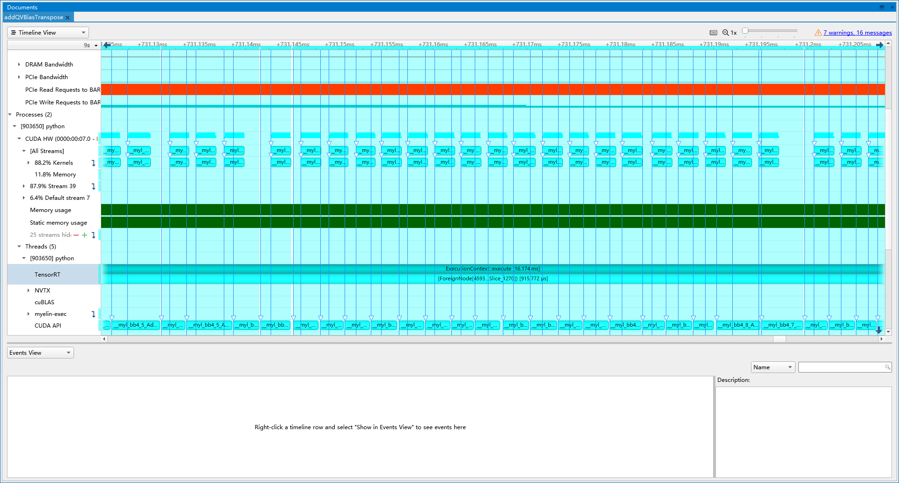
- 优化后(latency=15.3353 ms, throughtput=70.4344 qps, mAP=43.934%)：优化后的ForeignNode, 大部分都是内存的操作, 最终提速1.94%。
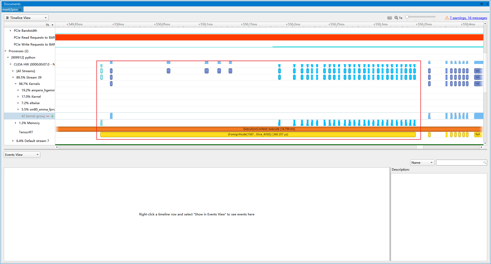

## 精度与加速效果
- 精度 最终优化模型在COCO2017验证集上的mAP=43.934%, 原始pytorch版本mAP=44.263%, 相比之下, mAP下降0.329%。
- 性能 最终优化模型的latency=15.3353 ms, throughtput=70.4344 qps, 相比于TRT自动优化的原始模型, 提速315.808%。

|Method|Latency(ms)|Throughtput(qps)|mAP(%)|
|---|---|---|---|
|TRT-TF32|46.2253|22.3029|8.686|
|&emsp;+MaskedSoftmax Plugin|39.5283|26.5501|44.270|
|&emsp;+FP16|18.0688|57.9584|43.977|
|&emsp;+opt-naiveSlice|17.3054|59.1553|43.977|
|&emsp;+merge-parameters|16.7689|62.9635|43.938|
|&emsp;+LayerNorm Plugin|16.5521|67.0348|43.891|
|&emsp;+AddBiasTranspose Plugin|15.7594|69.0925|43.920|
|&emsp;+Mask2Pos Plugin|15.3353|70.4344|43.934|

## 未来工作
- [ ] int8
- [ ] deepstream

## Bug 报告

详见[issue](https://github.com/NVIDIA/trt-samples-for-hackathon-cn/issues/33)
